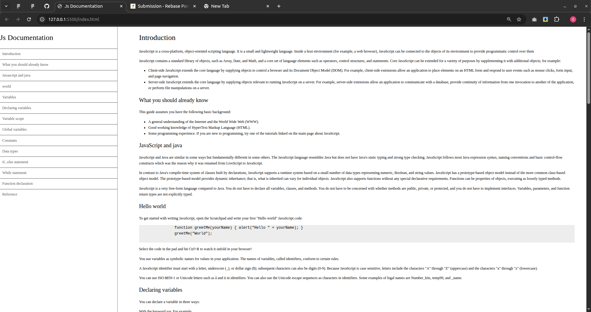

# TECHNICAL-DOCUMENTATION

(A simple overview/tagline of the project and its purpose.)

## Description

this is a js documentation that explains examples of JS 
It helps you solve js problems and easily understaand JS

## Installation

- .githut
- workflows
- linters.yml
- README.md
- index.html
- style.css

## Author

Mbopda Genny Miriane
